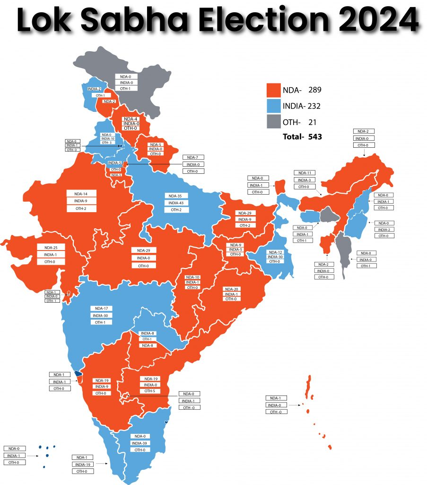
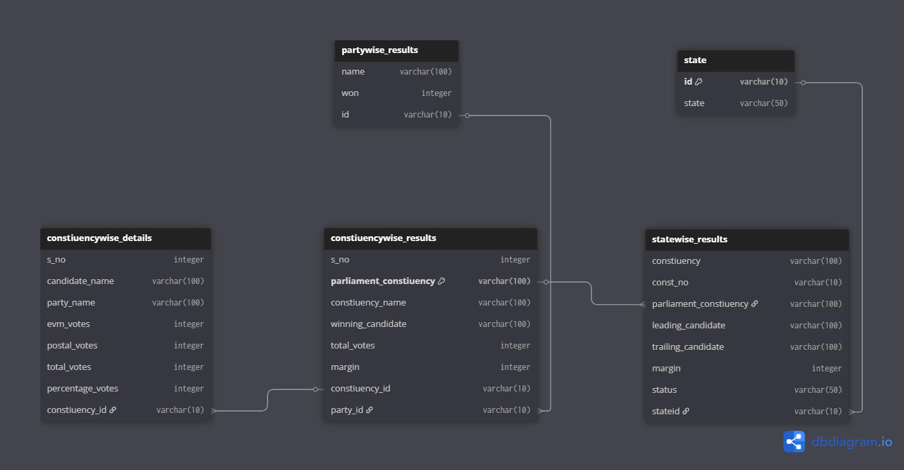

# 2024_General_Election_DataAnalaysis
This project explores Indian General Election results using SQL and CSV data. We designed a normalized database with state, party, constituency, and candidate details. We analyzed key patterns like margins, party wins, and vote shares by solving SQL queries on structured election data.
## Project Overview

**Project Title**: 2024 General Election DataAnalaysis

**Level**: Advanced  

**Database**: `elections_db`

This project demonstrates the implementation of an Indian Election Results Analysis System using SQL. It includes designing normalized tables, defining relationships, and executing complex SQL queries. The goal is to showcase skills in database design, data manipulation, and analytical querying.



## Objectives

1. **Design the Election Results Database**: Create and normalize tables for states, constituencies, candidates, parties, and election outcomes using real-world CSV data.
2. **Establish Relationships**: Implement foreign key constraints to ensure data integrity between tables.
3. **CRUD Operations**: Perform Create, Read, Update, and Delete operations to manage election data.
4. **CTAS (Create Table As Select)**: Use CTAS to generate derived tables for analytical insights like top margins and party-wise wins.
5. **Advanced SQL Queries**: Write complex queries to analyze state-wise results, vote margins, candidate comparisons, and party performance.



# 🗃️ Indian Elections SQL Project – Schema, CRUD, and Queries

## 🔨 Table Creation Scripts

```sql
-- State table
CREATE TABLE state (
    id INT PRIMARY KEY,
    state VARCHAR(100) NOT NULL
);

-- Statewise Results
CREATE TABLE statewise_results (
    stateid INT,
    parliament_constituency VARCHAR(100) PRIMARY KEY,
    winning_candidate VARCHAR(100),
    winning_party VARCHAR(100),
    margin INT,
    FOREIGN KEY (stateid) REFERENCES state(id)
);

-- Partywise Results
CREATE TABLE partywise_results (
    stateid INT,
    name VARCHAR(100),
    won INT,
    alliance VARCHAR(100),
    FOREIGN KEY (stateid) REFERENCES state(id)
);

-- Constituencywise Details
CREATE TABLE constituencywise_details (
    s_no INT,
    candidate_name VARCHAR(100) NOT NULL,
    party_name VARCHAR(100),
    evm_votes INT,
    postal_votes INT,
    total_votes INT,
    percentage_votes DECIMAL(5,2),
    constituency_id VARCHAR(100),
    FOREIGN KEY (constituency_id) REFERENCES statewise_results(parliament_constituency)
);

### 2. CRUD Operations

- **Create**: Inserted sample records into the `state` and `statewise_results` tables.  
- **Read**: Retrieved and verified data from tables.  
- **Update**: Updated alliance info in `partywise_results`.  
- **Delete**: Removed unwanted party records from `partywise_results`.

---

**Task 1: Create Records**

```sql
insert into state values (1, 'Andhra Pradesh');

insert into statewise_results 
values (1, 'Narsapuram', 'Bharath', 'TDP', 25000);
```

---

**Task 2: Read Data**

```sql
select * from state;

select * from statewise_results;
```

---

**Task 3: Update Party Alliance - NDA**

```sql
update partywise_results 
set alliance = 'NDA' 
where name in ('BJP', 'TDP', 'Jana Sena');
```

---

**Task 4: Update Party Alliance - INDIA**

```sql
update partywise_results 
set alliance = 'INDIA' 
where name in ('INC', 'DMK', 'SP', 'TMC');
```

---

**Task 5: Delete Unwanted Records**

```sql
delete from partywise_results 
where name = 'Independent';
```
### 3. SQL Analysis Queries

**Task 6: Count total seats**

```sql
select count(*) as total_seats from constituencywise_results;
```

---

**Task 7: Statewise Total Seats**

```sql
select statewise_results.stateid, state.state, count(*) as total_seats
from statewise_results
inner join state on statewise_results.stateid = state.id
group by state.id;
```

---

**Task 8: NDA Alliance Total Seats**

```sql
select sum(won) as nda_total
from partywise_results
where name in ('BJP', 'TDP', 'Jana Sena', 'Shiv Sena', 'Apna Dal', 'JD(U)', 'NISHAD', 'RPI', 'HAM', 'AGP');
```

---

**Task 9: Which Party Won Most Seats in Every State**

```sql
select state, name, max(won) as max_won
from (
  select s.state, p.name, pr.won,
         row_number() over(partition by s.state order by pr.won desc) as rnk
  from partywise_results pr
  join statewise_results sr on pr.name = sr.party_name
  join state s on sr.stateid = s.id
) as ranked
where rnk = 1;
```

---

**Task 10: Add Alliance Column**

```sql
alter table partywise_results add column alliance varchar(100);

update partywise_results
set alliance = 'NDA'
where name in ('BJP', 'TDP', 'Jana Sena', 'Shiv Sena', 'Apna Dal', 'JD(U)', 'NISHAD', 'RPI', 'HAM', 'AGP');

update partywise_results
set alliance = 'INDIA'
where name in ('INC', 'DMK', 'SP', 'TMC', 'AAP', 'RJD', 'CPM', 'CPI', 'IUML', 'JMM');
```

## Reports

- **Database Schema**: Includes structured tables for `state`, `statewise_results`, `partywise_results`, and `constituencywise_details` with relationships using primary and foreign keys.

- **Data Analysis**: 
  - Total number of seats won per party.
  - Statewise distribution of seats.
  - Top winning party in each state.
  - Total seats secured by major alliances like NDA and INDIA.

- **Summary Reports**: 
  - State-level and national-level seat distribution.
  - Alliance-wise performance.
  - Constituency-level candidate and vote insights.

## Conclusion

This project demonstrates the practical application of advanced SQL skills in building and analyzing a complete election results database. It covers full database design, CRUD operations, and complex analytical queries involving joins, grouping, filtering, and real-world political data analysis. This project strengthens SQL proficiency and prepares for handling real-time data in domains like politics, governance, and public datasets.

## How to Use

1. **Clone the Repository**: Clone this repository to your local machine.  
   [CLICK FOR CLONE](https://github.com/harshavardhanBOMMALATA/2024_General_Election_DataAnalaysis.git)

2. **Set Up the Database**: Open any SQL tool (e.g., MySQL Workbench) and execute the SQL scripts in the `election_project.sql` file to create tables and insert data.

3. **Run the Queries**: Use the SQL queries provided in the file to perform CRUD operations and detailed election analysis.

4. **Explore and Modify**: Modify the queries to extract deeper insights like party performance, alliance comparisons, state-wise trends, and more.

## Author - HARSHAVARDHAN BOMMALATA

This project showcases SQL skills essential for database management and analysis. For more content on SQL and data analysis, connect with me through the following channels:

- 📸 **Instagram**: [CONTACT ME PERSONALLY](https://www.instagram.com/ALWAYS_HARSHA_ROYAL/)
- 💼 **LinkedIn**: [Connect with me professionally](https://www.linkedin.com/in/harshavardhan-bommalata-7bb9442b0/)
- 📧 **Email**: HBOMMALATA@GMAIL.COM

Thank you for your interest in this project!

